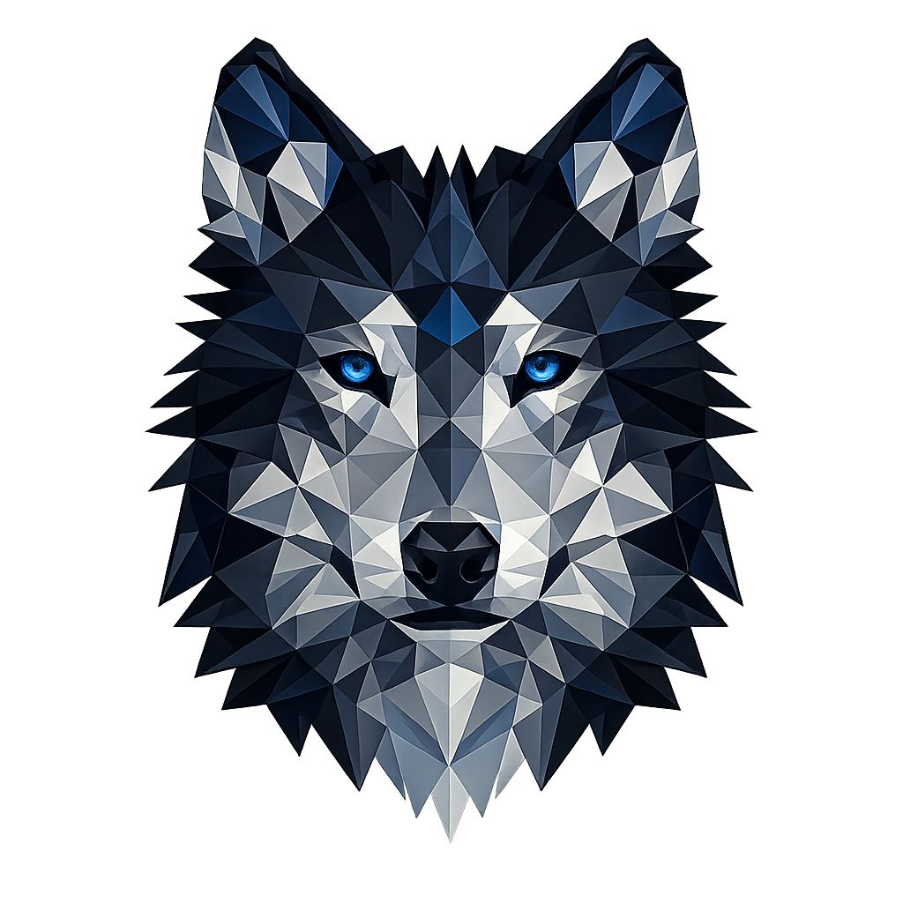

<div align="center">

<!--  -->

<br/>



<br/><br/>


<br/><br/>

<a href="https://www.linkedin.com/in/kritagya-yadav/"></a>
<a href="https://github.com/kritagya025"></a>
<a href="mailto:kritagyay2005@gmail.com"></a>


</div>


<br/>

## 🐺 The Instinct

<table align="center" border="0">
<tr>
<td>

```yaml
whoami:
  name:        Kritagya Yadav
  base:        Noida, Uttar Pradesh, India
  education:   B.Tech CSE @ KCC Institute of Technology (AKTU)
  graduating:  2027
  semester:    5th — actively building
  role:        Java / Spring Boot Developer
  focus:      [Backend Engineering, Problem Solving]
  learning:   [DevOps, Docker, CI/CD, AWS/Azure, Linux]
  mindset:     "Solitary focus. Relentless pursuit. Precise execution."
  contact:
    email:     kritagyay2005@gmail.com
    phone:     +91 8368099806
```

</td>
</tr>
</table>

<br/>

## 🎓 Certifications

<div align="center">

<table>
<tr>
<th>Certificate</th>
<th>Issuer</th>
<th>Date</th>
<th>Verify</th>
</tr>
<tr>
<td><b>Claude Code in Action</b></td>
<td>Anthropic</td>
<td>Mar 28, 2026</td>
<td><a href="https://verify.skilljar.com/c/jwyuk7funzq6"></a></td>
</tr>
<tr>
<td><b>Cyber Job Simulation</b></td>
<td>Deloitte Australia (Forage)</td>
<td>—</td>
<td>—</td>
</tr>
</table>

</div>

<br/>

## ⚔️ Arsenal

<div align="center">

**Languages**
<br/>


<br/><br/>

**Frameworks & Libraries**
<br/>


<br/><br/>

**Databases**
<br/>


<br/><br/>

**Data & ML Tooling**
<br/>


<br/><br/>

**Tools & Platforms**
<br/>


<br/><br/>

**Design & Creative**
<br/>


</div>

<br/>


<br/>

## 📊 The Hunt — GitHub Stats

<div align="center">


</div>

<br/>

## 🐾 Contribution Trail

<div align="center">


<sub>generated via a <a href="https://github.com/Platane/snk">Platane/snk</a> GitHub Action — see setup note below</sub>

</div>

<br/>

## 🏆 Trophy Case

<div align="center">


</div>

<br/>


<br/>

## 🧭 Territory Being Mapped

<div align="center">

<table>
<tr>
<td align="center" width="20%">☕<br/><b>Spring Boot</b><br/><sub>core strength</sub></td>
<td align="center" width="20%">🐳<br/><b>Docker</b><br/><sub>containerization</sub></td>
<td align="center" width="20%">⚙️<br/><b>CI/CD</b><br/><sub>pipelines</sub></td>
<td align="center" width="20%">☁️<br/><b>Cloud</b><br/><sub>AWS / Azure</sub></td>
<td align="center" width="20%">🔧<br/><b>Linux</b><br/><sub>administration</sub></td>
</tr>
</table>

</div>

<br/>

<div align="center">

> *"A lone wolf doesn't chase every trail — it studies one, masters it, and strikes with precision."*

</div>

<br/>


<div align="center">

### 🐺 Quiet in approach. Precise in execution. ⭐ Star a repo if this resonates.

<sub>Built with focus by Kritagya Yadav · Noida, India</sub>

</div>