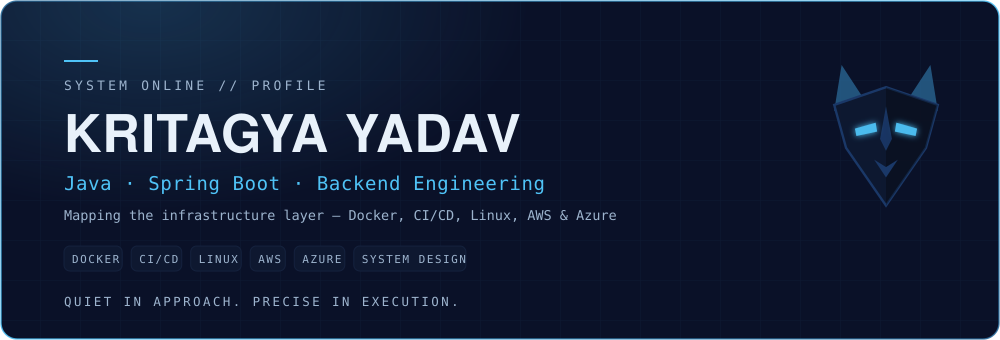
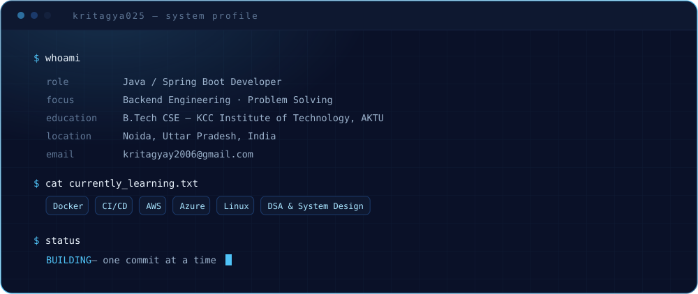
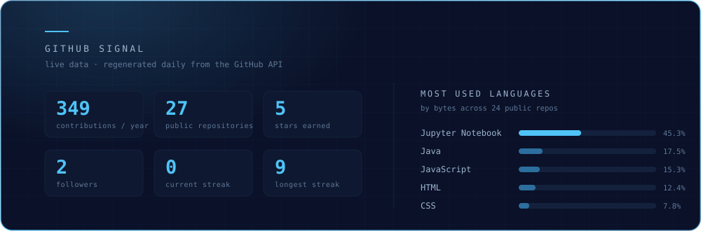
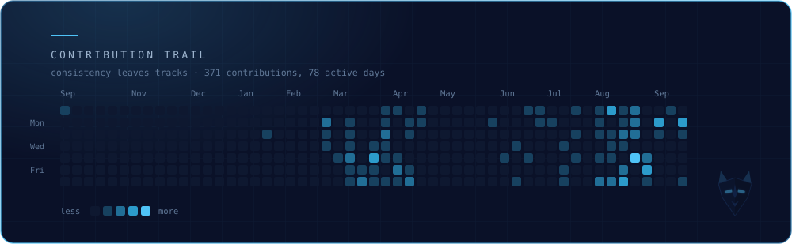
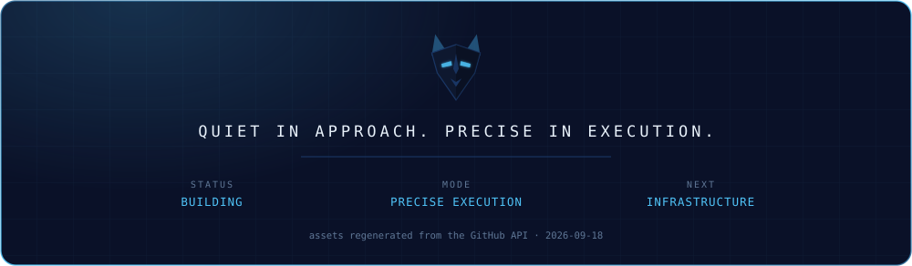

<!--
  kritagya025/README.md
  The cards in ./assets are generated by scripts/build_profile.py from live
  GitHub data and refreshed daily by .github/workflows/refresh-profile.yml.
  Edit the generator, not the SVGs.
-->

<!-- kept on one line: GitHub turns a newline between inline anchors into a   -->
   

- I enjoy solving programming problems and understanding how systems work.
- I like building backend applications and working with APIs and databases.
- I believe the best way to learn is by building real projects.
- My goal is to become a strong **Backend / Software Engineer**.

## Arsenal

<table>
  <tr>
    <td width="210"><b>Languages</b></td>
    <td></td>
  </tr>
  <tr>
    <td><b>Frameworks &amp; Libraries</b></td>
    <td></td>
  </tr>
  <tr>
    <td><b>Databases</b></td>
    <td></td>
  </tr>
  <tr>
    <td><b>Tools &amp; Platforms</b></td>
    <td></td>
  </tr>
</table>

## Featured Builds

<table>
  <tr>
    <td width="50%" valign="top">

### [KeyVault](https://github.com/kritagya025/KeyVault)

Secure management and handling of sensitive information.

`Java`

</td>
    <td width="50%" valign="top">

### [Event Booking System](https://github.com/kritagya025/Event-Booking-System)

Manages events and streamlines the booking process end to end.

`Java`

</td>
  </tr>
  <tr>
    <td width="50%" valign="top">

### [LinkPluse — URL Shortener](https://github.com/kritagya025/URL_SHORTNER-LinkPluse-)

A URL shortening service built around a backend-focused architecture.

`Java`

</td>
    <td width="50%" valign="top">

### [Student Management System](https://github.com/kritagya025/student-management)

Managing student records and the operations around them.

`Java`

</td>
  </tr>
  <tr>
    <td width="50%" valign="top">

### [Expense Tracker](https://github.com/kritagya025/Expense-Tracker)

Tracks expenses and personal financial records.

`HTML`

</td>
    <td width="50%" valign="top">

### [Disaster Coordination System](https://github.com/kritagya025/disaster-coordination-system)

Improves coordination and response during disaster situations.

`CSS`

</td>
  </tr>
</table>

## Certifications

<table>
  <tr>
    <td width="60" align="center">🤖</td>
    <td width="330"><b>Claude Code in Action</b></td>
    <td>Anthropic</td>
  </tr>
  <tr>
    <td align="center">🛡️</td>
    <td><b>Cyber Job Simulation</b></td>
    <td>Deloitte Australia — via Forage</td>
  </tr>
</table>

## Connect

<i>Good systems start with good conversations.</i>

<table>
  <tr>
    <td align="center" width="190">
      <a href="https://www.linkedin.com/in/kritagya-yadav/">
        
         <b>LinkedIn</b>
         Kritagya Yadav
      </a>
    </td>
    <td align="center" width="190">
      <a href="https://github.com/kritagya025">
        
         <b>GitHub</b>
         @kritagya025
      </a>
    </td>
    <td align="center" width="190">
      <a href="mailto:kritagyay2006@gmail.com">
        
         <b>Email</b>
         kritagyay2006
      </a>
    </td>
  </tr>
</table>

