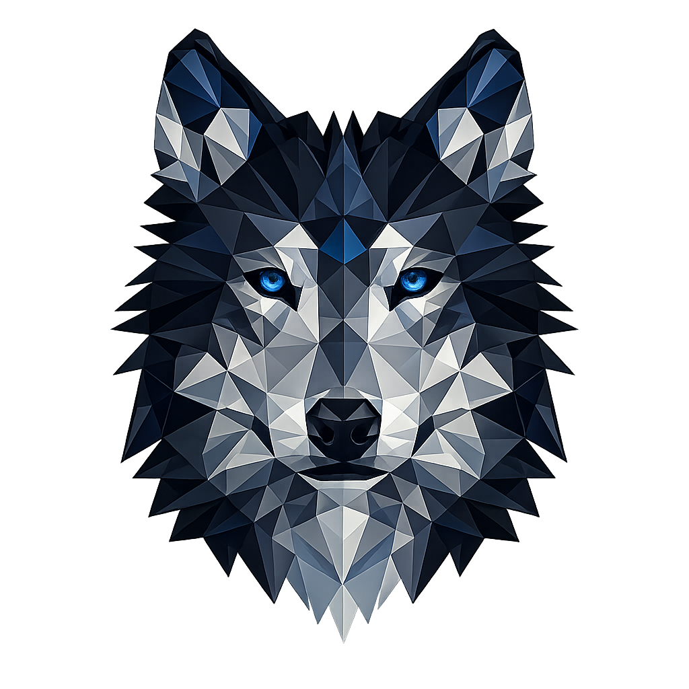

<!-- ═══════════════════════════════════════════════════════════════════════════
     🐺 KRITAGYA YADAV — GitHub Profile README
     Theme: Lone Wolf · Midnight Cyan · Precision Engineering
     ═══════════════════════════════════════════════════════════════════════════ -->


<div align="center">

<!-- ══════════════ AVATAR + IDENTITY ══════════════ -->

<a href="https://github.com/kritagya025">

</a>

<br/>

<picture>
  <source media="(prefers-color-scheme: dark)" srcset="https://readme-typing-svg.demolab.com?font=JetBrains+Mono&weight=700&size=28&duration=2400&pause=1200&color=4FC3F7&center=true&vCenter=true&width=700&height=45&lines=%F0%9F%90%BA+Sharp+Eyes.+Sharper+Code.">
  
</picture>

<br/>


<br/>

<!-- ══════════════ SOCIAL BADGES ══════════════ -->

<a href="https://www.linkedin.com/in/kritagya-yadav/">
  
</a>&nbsp;
<a href="https://github.com/kritagya025">
  
</a>&nbsp;
<a href="mailto:kritagyay2005@gmail.com">
  
</a>&nbsp;


</div>

<!-- ══════════════ DIVIDER ══════════════ -->


<br/>

<!-- ╔═══════════════════════════════════════════════════════════════════════╗
     ║                        🐺 THE INSTINCT                              ║
     ╚═══════════════════════════════════════════════════════════════════════╝ -->

##  &nbsp;The Instinct

<div align="center">
<table>
<tr><td>

```js
// ═══════════════════════════════════════════════════
//  $ whoami — Kritagya Yadav
// ═══════════════════════════════════════════════════

const wolf = {
    name:        "Kritagya Yadav",
    location:    "Noida, Uttar Pradesh, India",
    education:   "B.Tech CSE @ KCC Institute of Technology (AKTU)",
    graduating:  2027,
    semester:    "5th — actively building",
    
    role:        "Java / Spring Boot Developer",
    focus:       ["Backend Engineering", "Problem Solving"],
    learning:    ["DevOps", "Docker", "CI/CD", "AWS/Azure", "Linux"],
    
    mindset:     "Solitary focus. Relentless pursuit. Precise execution.",
    
    contact: {
        email:   "kritagyay2005@gmail.com",
        phone:   "+91 8368099806",
    },
    
    toString:    () => "A lone wolf that writes clean code.",
};
```

</td></tr>
</table>
</div>

<br/>

<!-- ══════════════ DIVIDER ══════════════ -->


<br/>

<!-- ╔═══════════════════════════════════════════════════════════════════════╗
     ║                     🎓 CERTIFICATIONS & BADGES                      ║
     ╚═══════════════════════════════════════════════════════════════════════╝ -->

## 🎓 &nbsp;Certifications & Badges

<div align="center">

<table>
<tr>
<th>🏅 Certificate</th>
<th>🏢 Issuer</th>
<th>📅 Date</th>
<th>🔗 Verify</th>
</tr>
<tr>
<td><b>🤖 Claude Code in Action</b></td>
<td>Anthropic</td>
<td><code>Mar 2026</code></td>
<td><a href="https://verify.skilljar.com/c/jwyuk7funzq6"></a></td>
</tr>
<tr>
<td><b>🛡️ Cyber Job Simulation</b></td>
<td>Deloitte Australia (Forage)</td>
<td><code>2025</code></td>
<td></td>
</tr>
</table>

</div>

<br/>

<!-- ══════════════ DIVIDER ══════════════ -->


<br/>

<!-- ╔═══════════════════════════════════════════════════════════════════════╗
     ║                          ⚔️ ARSENAL                                 ║
     ╚═══════════════════════════════════════════════════════════════════════╝ -->

## ⚔️ &nbsp;Arsenal — Tech Stack

<div align="center">

<!-- LANGUAGES -->
<details open>
<summary><b>⌨️ &nbsp;Languages</b></summary>
<br/>

</details>

<br/>

<!-- FRAMEWORKS -->
<details open>
<summary><b>🛠️ &nbsp;Frameworks & Libraries</b></summary>
<br/>

</details>

<br/>

<!-- DATABASES -->
<details open>
<summary><b>🗄️ &nbsp;Databases</b></summary>
<br/>

</details>

<br/>

<!-- DATA & ML -->
<details open>
<summary><b>📊 &nbsp;Data & ML Tooling</b></summary>
<br/>


</details>

<br/>

<!-- TOOLS -->
<details open>
<summary><b>🔧 &nbsp;Tools & Platforms</b></summary>
<br/>

</details>

<br/>

<!-- DESIGN -->
<details open>
<summary><b>🎨 &nbsp;Design & Creative</b></summary>
<br/>


</details>

</div>

<br/>

<!-- ══════════════ DIVIDER ══════════════ -->


<br/>

<!-- ╔═══════════════════════════════════════════════════════════════════════╗
     ║                    🔥 FEATURED PROJECTS                             ║
     ╚═══════════════════════════════════════════════════════════════════════╝ -->

## 🔥 &nbsp;Featured Projects

<div align="center">

<a href="https://github.com/kritagya025/KeyVault">
  
</a>
<a href="https://github.com/kritagya025/Event-Booking-System">
  
</a>
<a href="https://github.com/kritagya025/URL_SHORTNER-LinkPluse-">
  
</a>
<a href="https://github.com/kritagya025/student-management">
  
</a>
<a href="https://github.com/kritagya025/Expense-Tracker">
  
</a>
<a href="https://github.com/kritagya025/disaster-coordination-system">
  
</a>

</div>

<br/>

<!-- ══════════════ DIVIDER ══════════════ -->


<br/>

<!-- ╔═══════════════════════════════════════════════════════════════════════╗
     ║                    📊 THE HUNT — GITHUB STATS                       ║
     ╚═══════════════════════════════════════════════════════════════════════╝ -->

## 📊 &nbsp;The Hunt — GitHub Stats

<div align="center">

<!-- Row 1: Stats + Languages -->


<br/><br/>

<!-- Row 2: Streak Stats (FIXED: using demolab.com instead of dead herokuapp) -->


<br/><br/>

<!-- Row 3: Activity Graph -->


</div>

<br/>

<!-- ══════════════ DIVIDER ══════════════ -->


<br/>

<!-- ╔═══════════════════════════════════════════════════════════════════════╗
     ║                        🏆 TROPHY CASE                               ║
     ╚═══════════════════════════════════════════════════════════════════════╝ -->

## 🏆 &nbsp;Trophy Case

<div align="center">


</div>

<br/>

<!-- ══════════════ DIVIDER ══════════════ -->


<br/>

<!-- ╔═══════════════════════════════════════════════════════════════════════╗
     ║                  🐾 CONTRIBUTION SNAKE                              ║
     ╚═══════════════════════════════════════════════════════════════════════╝ -->

## 🐾 &nbsp;Contribution Trail

<div align="center">

<picture>
  <source media="(prefers-color-scheme: dark)" srcset="https://raw.githubusercontent.com/kritagya025/kritagya025/output/github-snake-dark.svg" />
  <source media="(prefers-color-scheme: light)" srcset="https://raw.githubusercontent.com/kritagya025/kritagya025/output/github-snake.svg" />
  
</picture>

<sub>🔄 Auto-generated via <a href="https://github.com/Platane/snk">Platane/snk</a> GitHub Action — <a href="#-setup-instructions">setup guide below</a></sub>

</div>

<br/>

<!-- ══════════════ DIVIDER ══════════════ -->


<br/>

<!-- ╔═══════════════════════════════════════════════════════════════════════╗
     ║                  🧭 TERRITORY BEING MAPPED                          ║
     ╚═══════════════════════════════════════════════════════════════════════╝ -->

## 🧭 &nbsp;Territory Being Mapped — 2026 Focus

<div align="center">

```
   ┌──────────────────────────────────────────────────────────────────────┐
   │                                                                      │
   │    ☕ Spring Boot        ██████████████████████████████  CORE         │
   │    🐳 Docker            ████████████████████░░░░░░░░░░  LEARNING     │
   │    ⚙️  CI/CD             ███████████████░░░░░░░░░░░░░░░  EXPLORING    │
   │    ☁️  AWS / Azure       ██████████░░░░░░░░░░░░░░░░░░░░  NEXT UP      │
   │    🐧 Linux Admin       ████████████████████░░░░░░░░░░  GROWING      │
   │    🔐 System Design     ████████░░░░░░░░░░░░░░░░░░░░░░  STUDYING     │
   │                                                                      │
   └──────────────────────────────────────────────────────────────────────┘
```

</div>

<br/>

<!-- ══════════════ DIVIDER ══════════════ -->


<br/>

<!-- ╔═══════════════════════════════════════════════════════════════════════╗
     ║                     📡 HOW I WORK                                   ║
     ╚═══════════════════════════════════════════════════════════════════════╝ -->

## 📡 &nbsp;How I Work

<div align="center">

<table>
<tr>
<td width="50%" valign="top">

**🔄 Workflow**
- Clean, documented code — always
- Small, atomic PRs with context
- Test before you ship, every time
- Git-flow branching strategy

</td>
<td width="50%" valign="top">

**🧠 Philosophy**
- Backend-first thinking
- Obsess over API design
- Automate the boring stuff
- Learn in public, build in private

</td>
</tr>
</table>

</div>

<br/>

<!-- ══════════════ DIVIDER ══════════════ -->


<br/>

<!-- ╔═══════════════════════════════════════════════════════════════════════╗
     ║                     ⚡ QUICK STATS                                  ║
     ╚═══════════════════════════════════════════════════════════════════════╝ -->

<div align="center">

```
  ┌──────────────────────────────────────────────────────┐
  │  📦 25 Repositories  │  ⭐ 6 Stars  │  👥 2 Followers │
  └──────────────────────────────────────────────────────┘
```

</div>

<br/>

<!-- ══════════════ WOLF QUOTE ══════════════ -->

<div align="center">

> *"A lone wolf doesn't chase every trail —*
> *it studies one, masters it, and strikes with precision."* 🐺

</div>

<br/>

<!-- ══════════════════════════════════════════════════════════════════════════════ -->
<!-- 🐺 SETUP INSTRUCTIONS (collapsed — not visible on profile unless expanded)  -->
<!-- ══════════════════════════════════════════════════════════════════════════════ -->

<details>
<summary><b>⚙️ Setup Instructions</b> — Snake Animation GitHub Action</summary>

<br/>

To make the **Contribution Snake** work, create this file in your profile repo:

**`.github/workflows/snake.yml`**

```yaml
name: Generate Snake Animation

on:
  schedule:
    - cron: "0 */12 * * *"  # every 12 hours
  workflow_dispatch:

jobs:
  generate:
    runs-on: ubuntu-latest
    timeout-minutes: 10
    steps:
      - name: Generate Snake
        uses: Platane/snk/svg-only@v3
        with:
          github_user_name: ${{ github.repository_owner }}
          outputs: |
            dist/github-snake.svg
            dist/github-snake-dark.svg?palette=github-dark
        env:
          GITHUB_TOKEN: ${{ secrets.GITHUB_TOKEN }}

      - name: Deploy to output branch
        uses: crazy-max/ghaction-github-pages@v4
        with:
          target_branch: output
          build_dir: dist
        env:
          GITHUB_TOKEN: ${{ secrets.GITHUB_TOKEN }}
```

After creating this file, go to **Actions** tab → **Generate Snake Animation** → **Run workflow**.

</details>

<br/>

<!-- ══════════════ FOOTER ══════════════ -->


<div align="center">

### 🐺 Quiet in approach. Precise in execution.

<sub>Built with focus by <b>Kritagya Yadav</b> · Noida, India</sub>
<br/>
<sub>⭐ Star a repo if this resonates.</sub>

</div>
